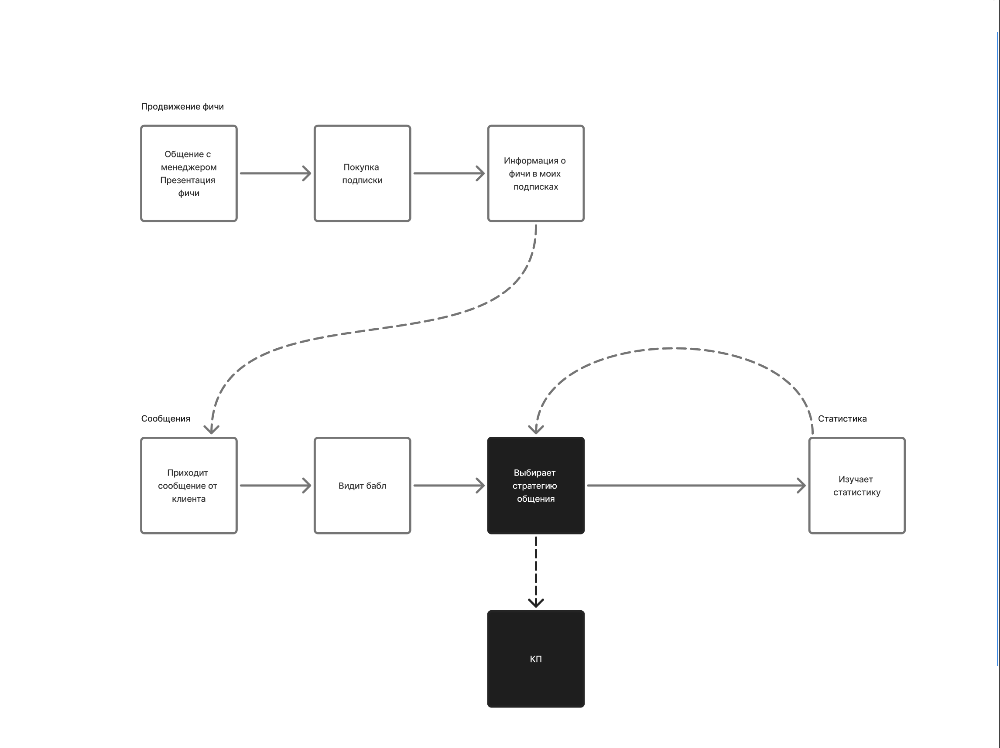
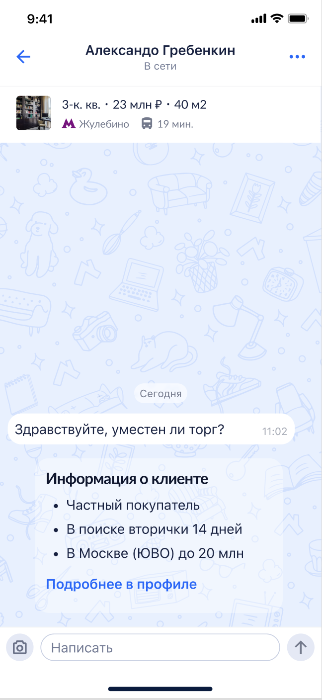
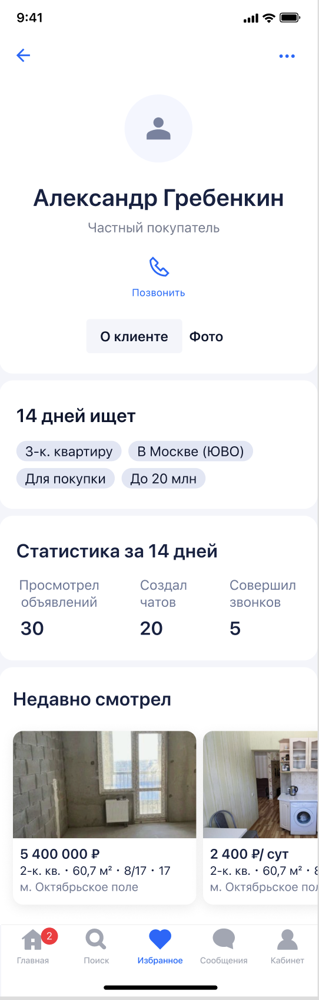
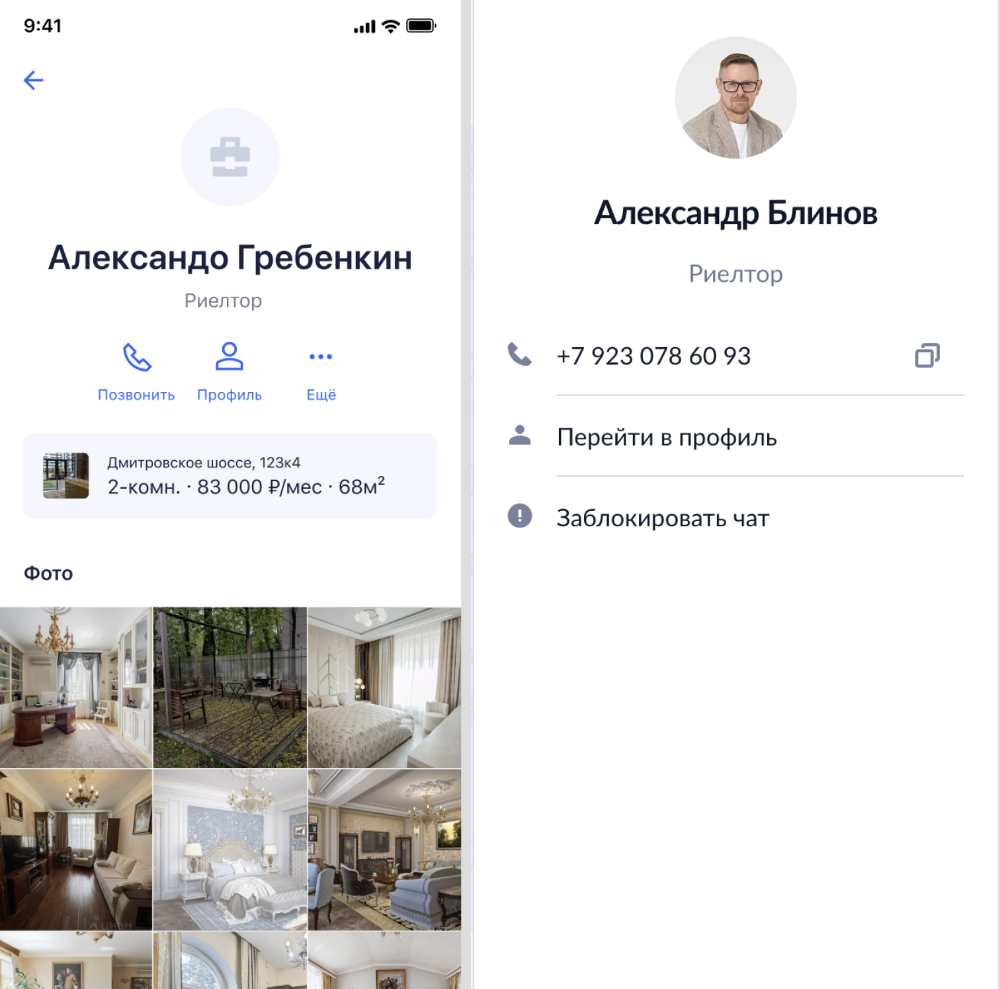
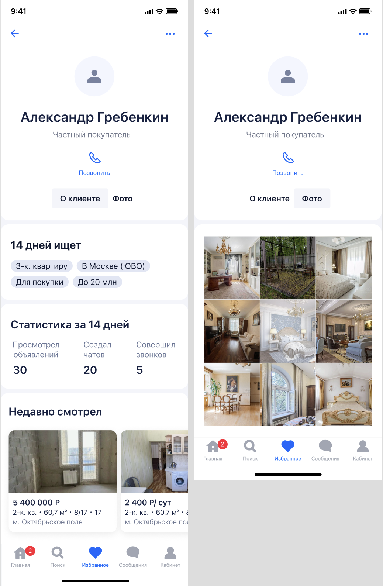
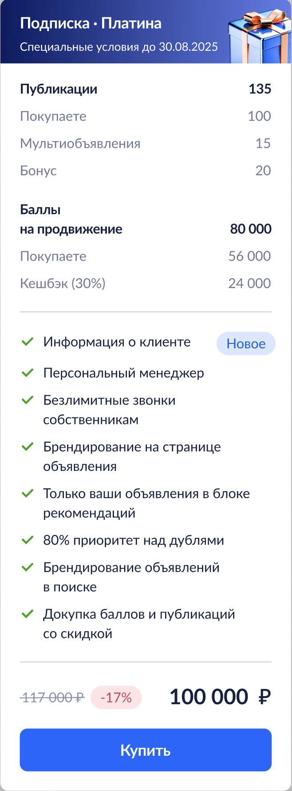

## Контекст

По данным исследования наши пользователи — риелторы хотят знать знать образ пользователя, который пишет им личные сообщения на Циане. Такая потребность у них возникла из-за разной модели общения в зависимости от разной заинтересованности пользователей. Проще говоря, риелторам важно ответить быстро и правильно “Горячему клиенту”.

## Процесс работы

Для того, чтобы лучше понимать, по каким данным риелторы принимают решения, я провел интервью с 10 респондентами и выяснил, что пользователям важно знать, какой объект ищет их потенциальный клиент, в каком городе, районе и как давно, а также бюджет будущей покупки или аренды. Кроме того, важна также статистика за какой-то период в прошлом (просмотры, звонки, чаты) и список просмотренных объявлений. Эти данные должны помочь риелторам грамотно строить коммуникацию с клиентами.

Собрав эти данные, я отправился к разработке, чтобы уточнить все ли можем отображать. После этого получил апрув от юристов.

Монетизировать будущую фичу было решено через включение его в состав максимальной подписки. По подсчетам за счет перетока 5% трафика с более низких уровней подписки это бы принесло нам более 5 млн в месяц, а также увеличением удовлетворенности клиентов нашим продуктом, что влияло бы не метрику предпочтения.

Собрав схематично архитерктуру будущей фичи, я пошел это обсудить со смежной командой, которая является мейнтейнером чатов. Во время обсуждения было принято решение отображать превью информации в виде компонента ДС, а остальную информацию в профиле. Однако экран профиля в чатах был устаревшим в плане UI и с легаси элементами. Это было хорошим поводом немного расширить скоуп работ, но зато привести в порядок. Я уточнил у разработки сколько дополнительного времени это займет и можем ли мы попутно улучшить страницу. Оказалось, изменения со стороны разработки небольшие. Я принялся за реализацию.

Старый вид экрана риелтора

Новый вид

Также подсветил новую фичу в подписке

## Результат

После релиза на более дорогой вид подписки перешло 5,3 % пользователей, что принесло нам более 5 млн рублей в месяц.
