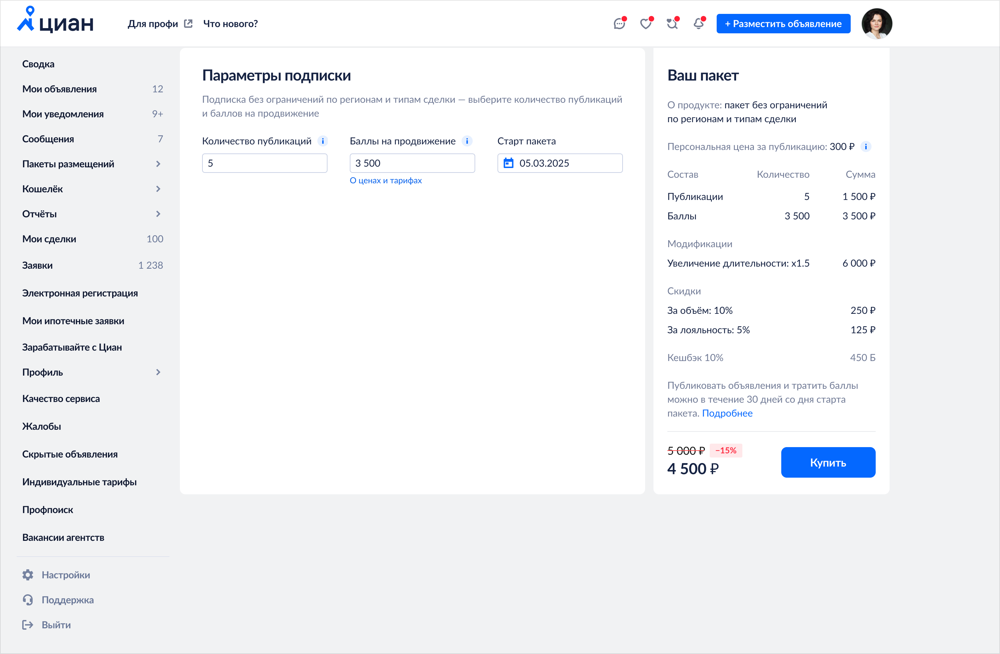
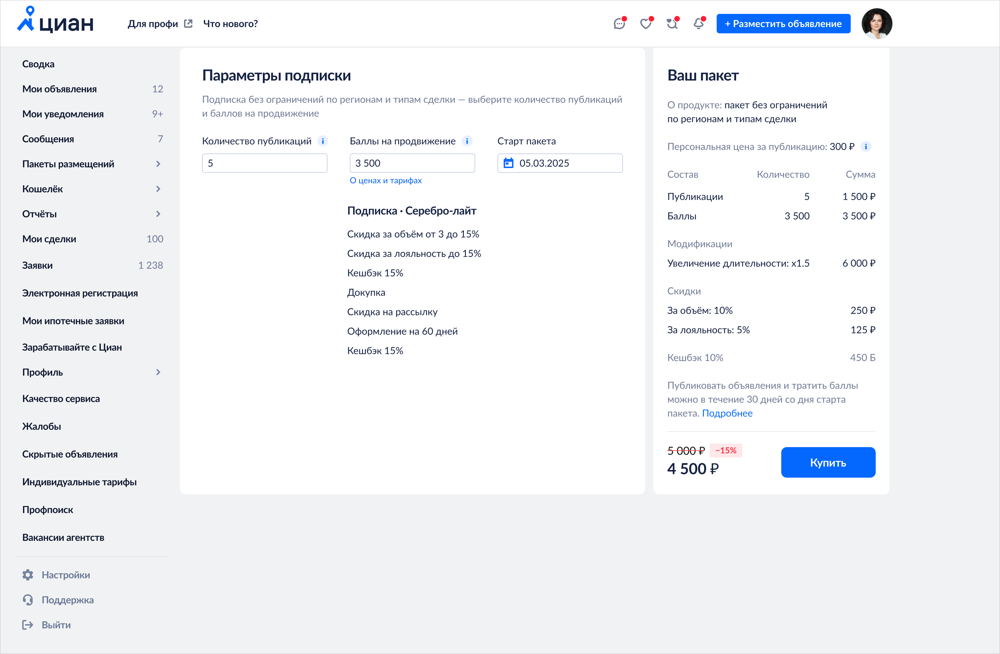
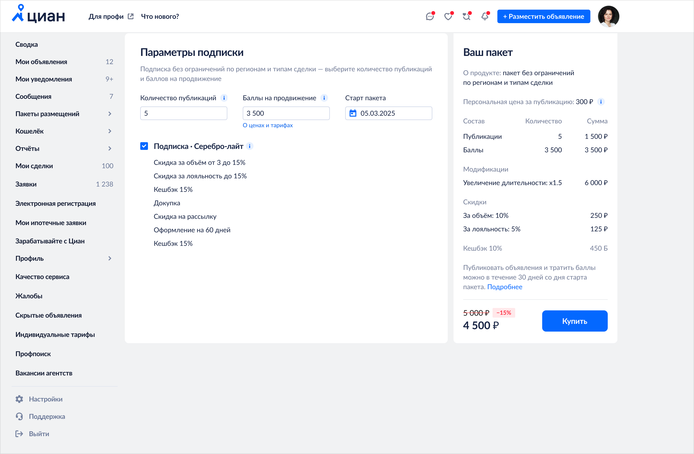
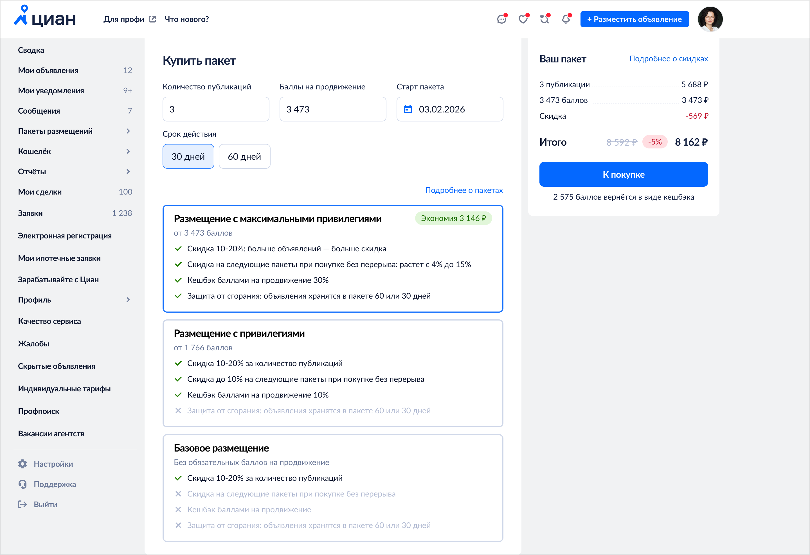

## Context

Cian is Russia's largest real estate marketplace. In the agent's account there is a page where they buy a listing package. A package is a bulk purchase at a lower unit price: five listings bought one by one cost ₽100 each, inside a package — ₽60. A package can also include promotion points, the internal currency: one point equals one rouble.

Next to packages there are subscriptions — essentially the same packages, but with extra benefits such as a personal manager.

The hypothesis: if we add a light subscription tier with features and a mandatory purchase of points, VAS penetration into package revenue will double, and overall product revenue will grow with it.

The design task that followed: show the benefits and the point threshold at which they unlock — without sending the user to a separate page.

## Process

### First concepts

My first attempt put the benefits straight into the order summary on the right: change the points, and the benefit list updates. But that panel is already dense with numbers, and the benefits got lost in it.

The second attempt pulled the subscription out as a separate checkbox with the benefits listed underneath. More visible — but a new problem appeared: it was unclear what "Silver Lite" even was and why anyone should take it. This is the version I took to the interviews.

### What users said

The interviews showed the solution did not read:

- Discounts were unclear, and nobody opened the info tooltips
- There was no middle option: a bad one and a good one, nothing in between, so the choice felt unfinished
- The naming said nothing. We had started from the real benefits of subscriptions, but this cohort does not know about subscriptions — "Silver Lite" is just a word to them
- A headline matters more than a bullet list: the difference between options has to be stated outright

### What changed after the interviews

- Turned the cards vertical — more room for text, and benefits written out in words instead of abbreviations
- Added a third option: a middle tier between basic and maximum
- Removed the tooltips. Everything that affects the decision now sits on the surface of the card
- Rewrote the headlines: "Listing with maximum privileges" instead of "Silver Lite"

Along the way I decluttered the checkout. The user saw a lot of numbers but could not tell how the total came together. I raised it with the engineers and they found room within the same task. I kept the contents, a single discount line, a clear total and the cashback amount — the rest moved into "More about discounts".

## Outcome

We shipped an A/B test. Average order value in the builder grew 2.5%, VAS revenue 6.1%, and conversion into a builder purchase with points 22%.

In money terms that added ₽4M a month to the product.
