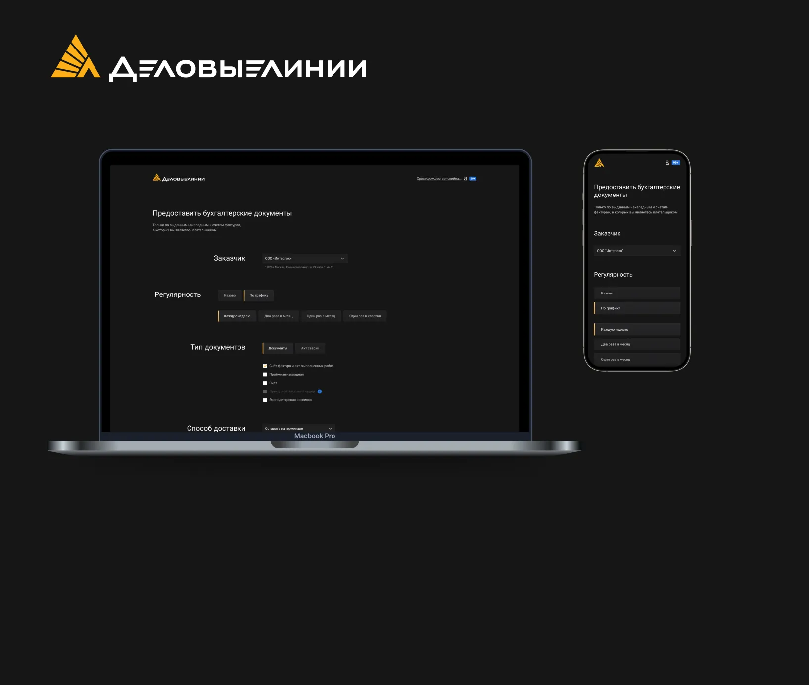
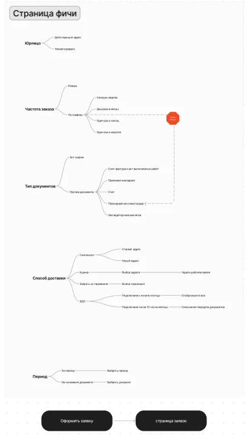
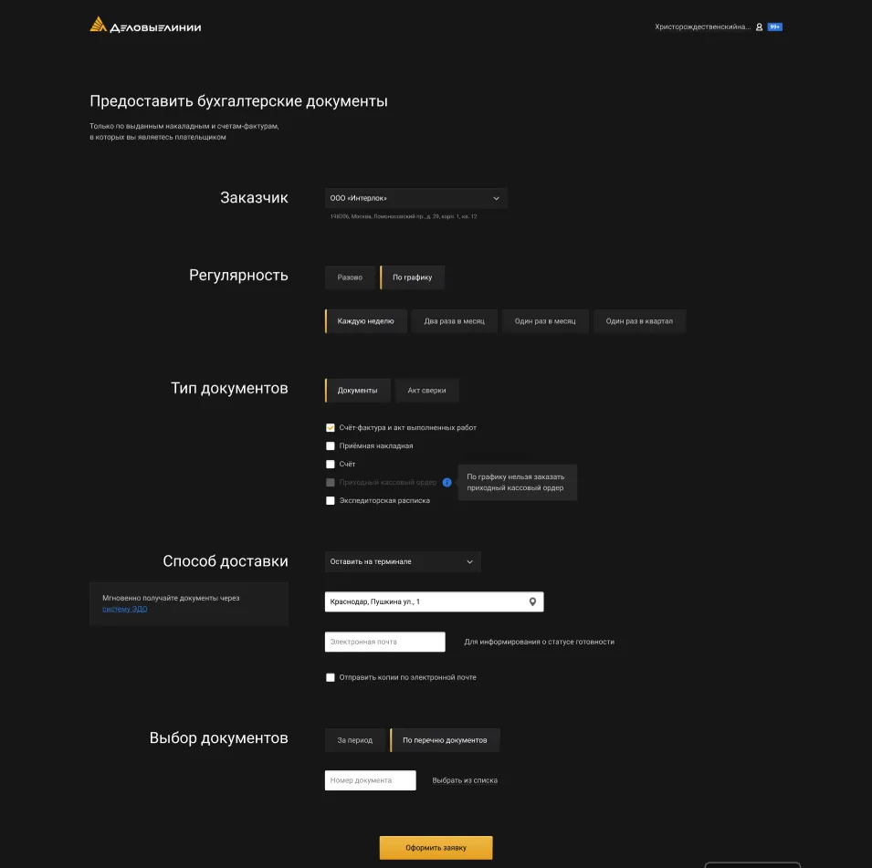
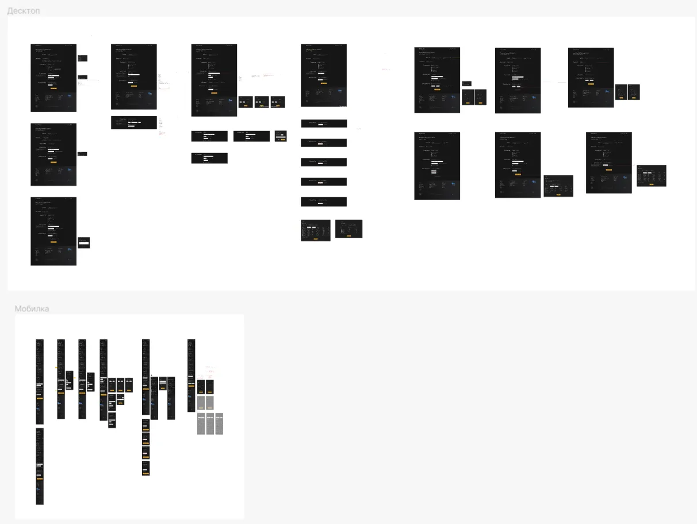

## Задача

B2B клиенты Деловых Линий заказывали бухгалтерские документы через своего менеджера. В связи с этим менеджеры были перегружены рутинной работой и допускали ошибки.

## Решение

Было решено создать функцию заказа бухгалтерских документов через интерфейс личного кабинета пользователей. Для начала я установил, какими параметрами пользуются юзеры при заказе документов и какие могут быть кейсы.

### Прототипирование

Мобилка

Все кейсы

## Результат

В результате удалось создать новую фичу — заказ бухгалтерских документов, которая позволила повысить лояльность B2B клиентов и разгрузить персональных менеджеров.
