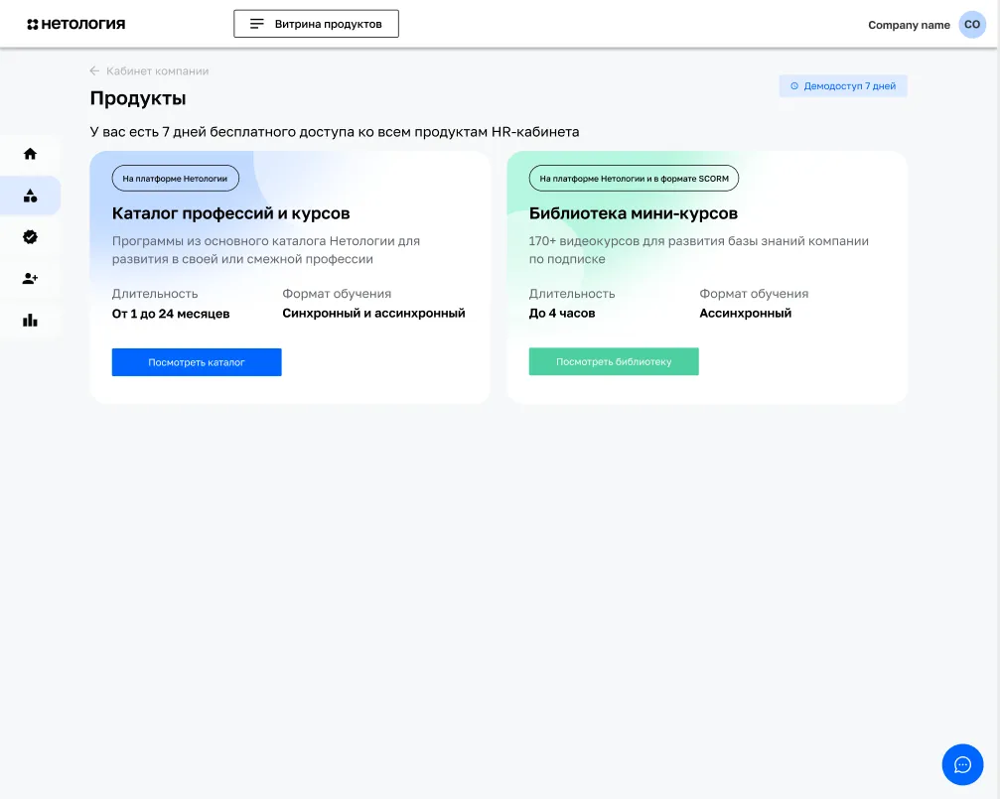
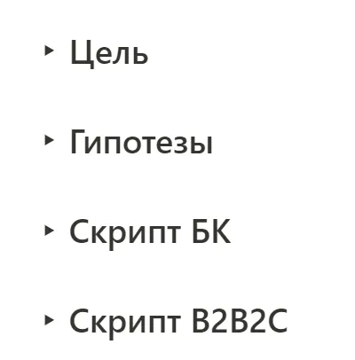
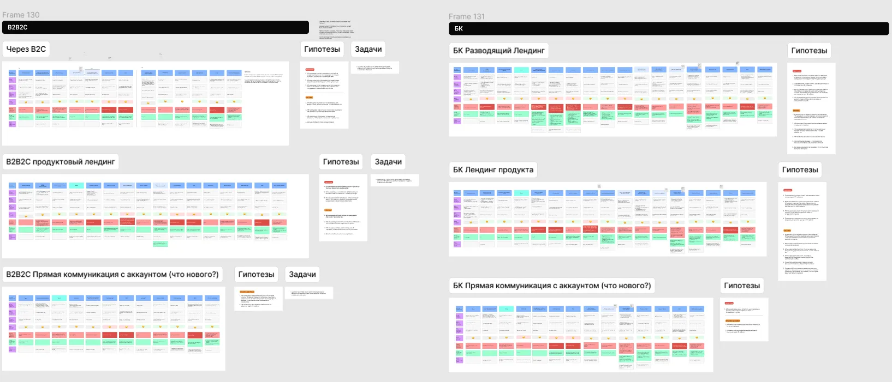

## Цель исследования

Не было четкого понимания наших пользователей, их мотиваций и барьеров, джобов и этапов, которые они проходят от получения задачи на обучения до оценки результатов этого обучения. Также для развития продукта требовалось составить бэклог задач. Кроме того, у нас был ряд гипотез, которые требовали проверки.

## Исследование

Сейчас у нас есть 1 B2B продукт — HR-Кабинет, в котором 2 продукта: профессии (длительное обучение) и мини-курсы по подписке.

HR-кабинет (MVP)

Мы с продактом отобрали по 12 пользователей каждого продукта, я написал скрипт для каждой группы, обозначив разные точки коммуникаций.

После первых двух интервью я понял, что нужно корректировать скрипт, так как мне не удавалось добиться четких ответов в отношении этапов работы респондентов. В результате я пришел к тому, что сделал скрипт более открытым, где изначально обозначил цель установления этих этапом. В таком виде интервью проходили более продуктивно

## Результат

В результате у меня получилось 6 CJM. Часть гипотез подтвердилась, но большая часть была опровергнута. Я определил барьеры пользователей и выделил наиболее критичные. Задачи по ним были сформулированы и помещены в бэклог.

