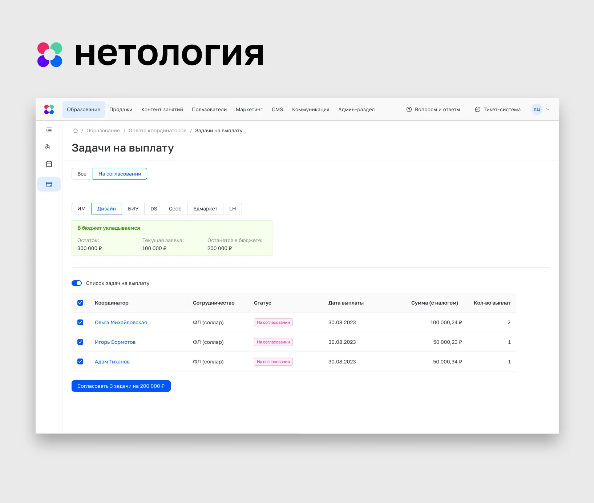
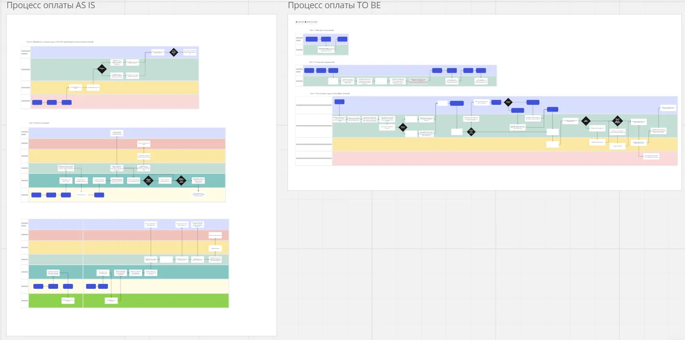
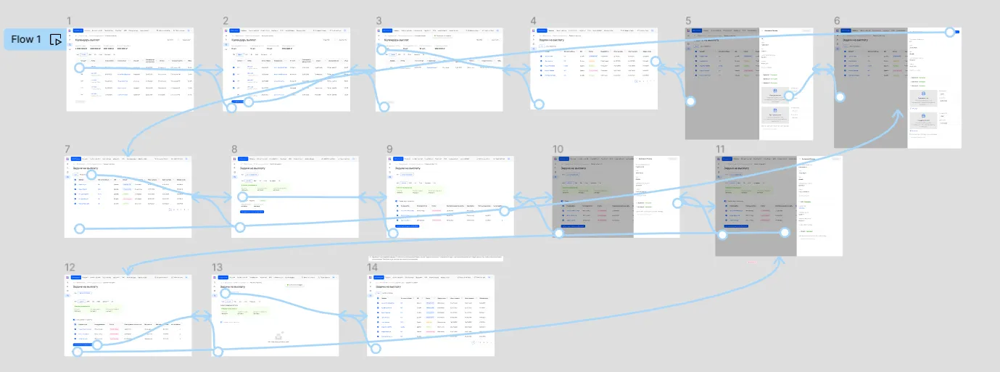
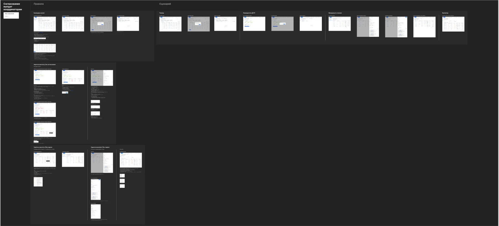

## Проблема

Не существовало процесса двойного согласования выплат координаторам курсов в единой среде. Бухгалтеры, бюджетные контроллеры работали в разных программах, что создавало неудобство в работе.

## Решение

### Этап 1. Discovery

Так как схемы процесса не существовало, необходимо было понять, как сейчас все работает. Сложность заключалось, что все стейкхолдеры знали только свою часть. Пришлось потратить много времени на discovery. Дополнительная сложность было в том, чтобы понять специфику работы каждой кагорты. В результате удалось создать схемы AS IS и TO BE.

Схемы процессов AS IS и TO BE

### Этап 2. Создание прототипа/Тестирование

Я исключил этап работы с LO-FI прототипами так как в приоритете была скорость. К тому же я работал с библиотекой ант-дизайна. Я протестил кликабельный прототип на всех группах пользователей. В результате пришлось внести некоторые правки так как были подсвечены некоторые неучтенные кейсы.

Прототип

### Этап 3. Спецификация

После внесения правок я написал спецификацию для разработчиков.

Спецификация

## Результат

Нам с командой удалось с нуля создать новый процесс, затрагивающий 3 категории пользователей и перенести весь флоу из трех разных программ в одну админку. Получили положительный фитбэк.
