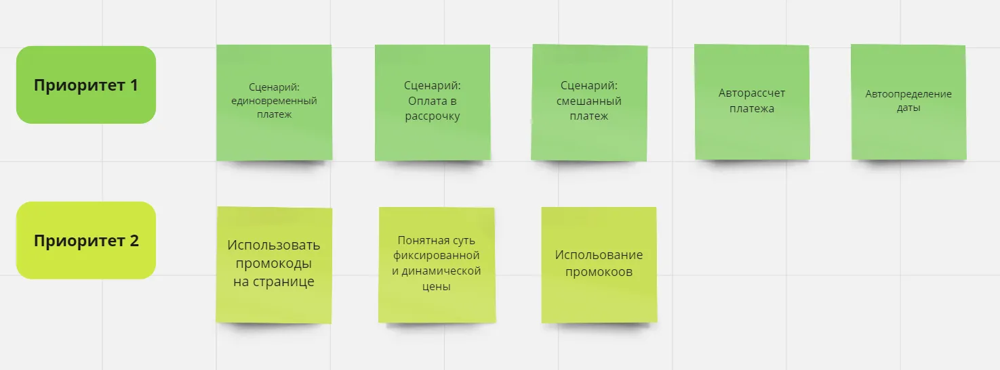
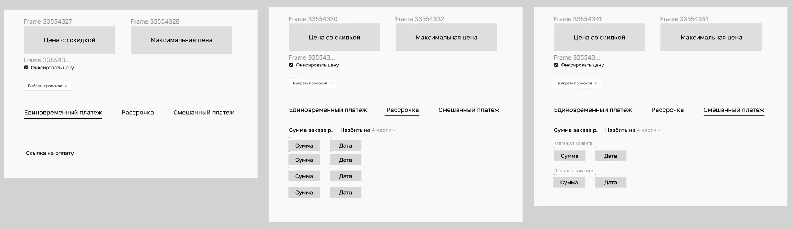

## Problem

The request came from the head of the sales department at Netology, an online education company with more than 3 million users a month. Sales managers were spending around 10 minutes placing a single order, and the reason was poor UX and dead ends on the order page.

The goal was to speed up work on an order and raise the average number of orders one manager places per day. At the time that number was around 20.

## Solution

### Stage 1. Research

The order page is made up of several blocks, and managers move through it top to bottom while talking to the customer. I started by finding out where exactly they got stuck, and ran interviews with 7 respondents.

**Four of the seven rated the payment block 8 out of 9 for convenience. The other three also gave it 8. Given how the problem had been described, the result looked strange.**

The research pointed at the "Payment" block. It turned out that about 70% of all purchases go through in-house instalments: a fixed amount is charged to the payer's card every month as a recurring payment. Managers were calculating the monthly amount on a calculator, and typing the date into every single payment field by hand, one month apart.

Managers named three payment types in total: a one-off payment, instalments, and a mixed payment where part is paid immediately and the rest in instalments. Each of the three flows required a specific order of steps, with the manager holding the state in their head.

Pricing was also split into fixed and dynamic. In 90% of cases the manager applies a discount promo code — which meant going to a spreadsheet, finding the current code, copying it and pasting it into the order page. The closer the course start date, the lower the price. Managers told me that with dynamic pricing the discounted price keeps changing as the start date approaches.

On top of that, around 40% of the customers on a recurring payment want to repay early. In that scenario, if a customer wants to pay off part of the balance and shorten the schedule, the manager goes into payment editing, increases one of the payments and reduces their number.

So on one hand I had found a stack of friction and dead ends; on the other, users had rated the order flow highly. My hypothesis was that the people I had interviewed were simply used to the admin panel's flaws. To test it, I interviewed a cohort of managers who had joined recently — less than six months earlier. I found three. They rated the admin panel 4 out of 9, calling out confusing naming and a lot of manual work that eats up attention.

The old interface

### Stage 2. Prioritizing needs

I started this stage by prioritizing the tasks sales managers perform. Priority 1 went to the core scenarios that take the most time in the current implementation; priority 2 to secondary scenarios, or ones that are quick anyway.

Sticky notes in Miro

### Stage 3. Lo-fi mockups

Based on those needs I put together a rough version in Figma as a basis for the discussion with the product manager. Then I went to the backend team to check what was feasible, and tested the solution with managers. There were a few comments; I noted what needed fixing and moved on to hi-fi.

Lo-fi mockups

### Stage 4. Hi-fi mockups

In the hi-fi mockups I improved the UX of several functions.

I worked closely with the sales team lead, and together we went through every possible case in the payment block.

### Stage 5. Handover to engineering

After handing the mockups to the frontend team, we decided to split the work: build the upper block first and the lower one in the next sprint.

## Outcome

After release the team got a lot of positive feedback from sales managers. Time spent on one order dropped from 10 to 5 minutes on average — a 50% reduction achieved through the interface alone.
