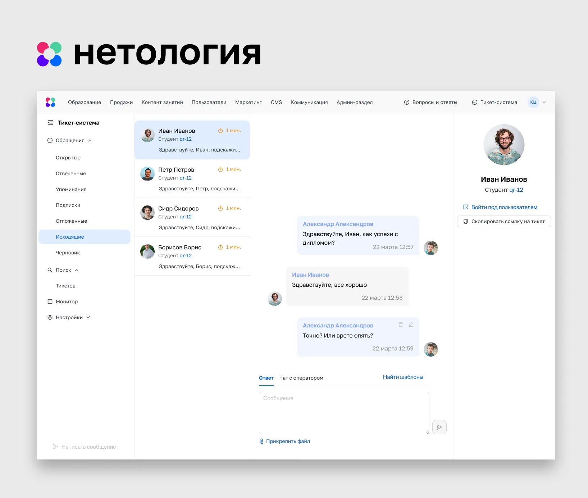
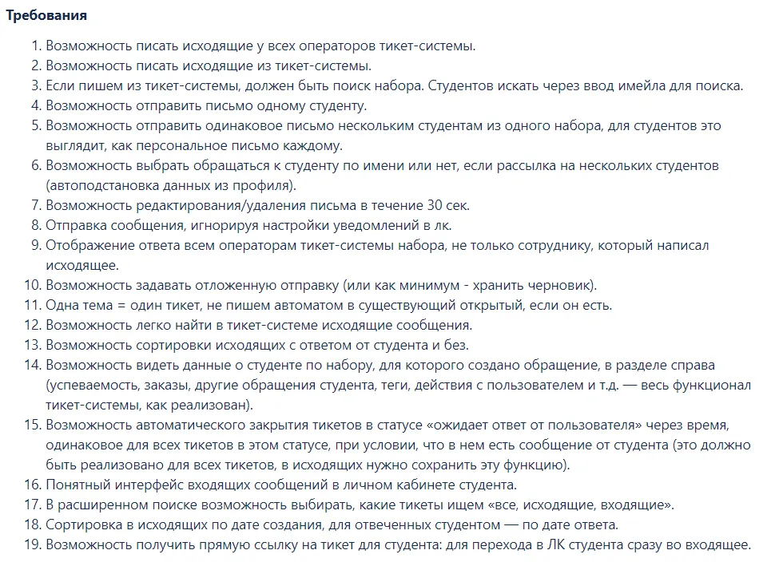
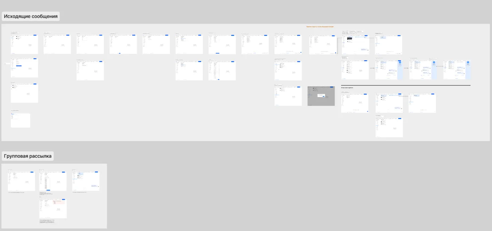

## Problem

There was no single space for talking to students. As a result the context of a conversation kept getting lost and student questions took a long time to resolve.

## Solution

We decided to add outgoing messages to the ticket system. The task came with 19 requirements.

The ticket system interface already existed, so the new feature had to fit into it naturally. It was important to handle group messages and tagging other Netology employees, and to use as few custom elements as possible.

One of the screens

### Stage 2. Testing

While designing, I tested my solutions on coordinators — the end users — since I was in constant contact with them.

### Stage 3. Specification

In the specification I split the work into creating outgoing messages and sending messages to a group. We decided to build group messages a few sprints later.

## Outcome

All communication with students moved into a single internal channel, and the coordinators' feedback was positive.
