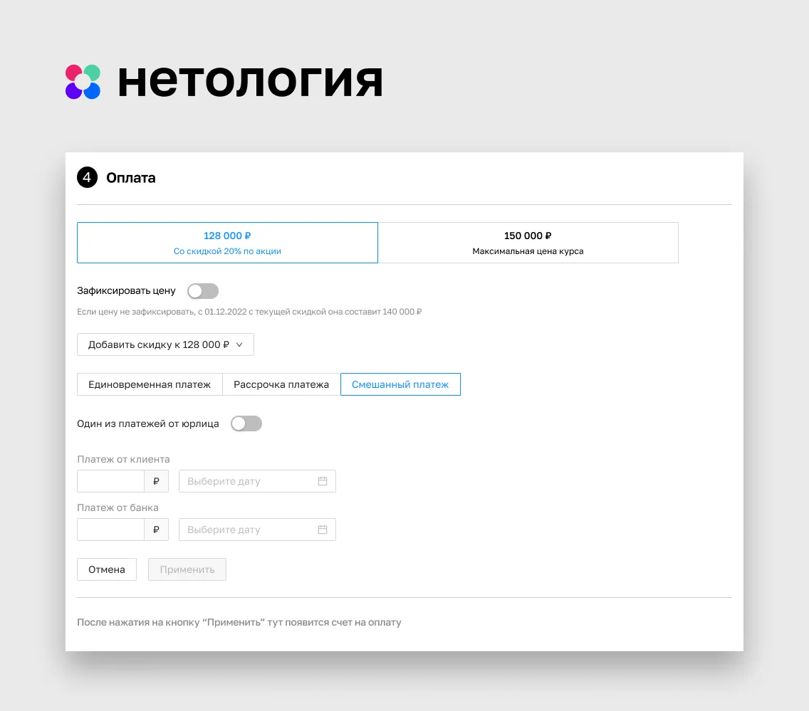
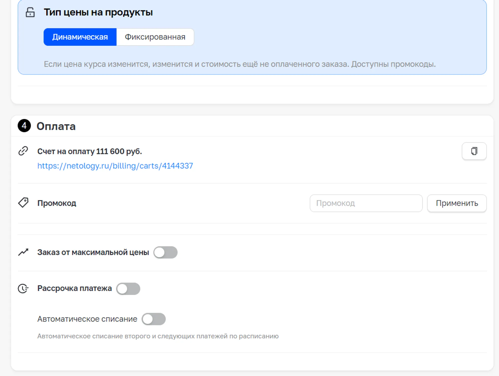
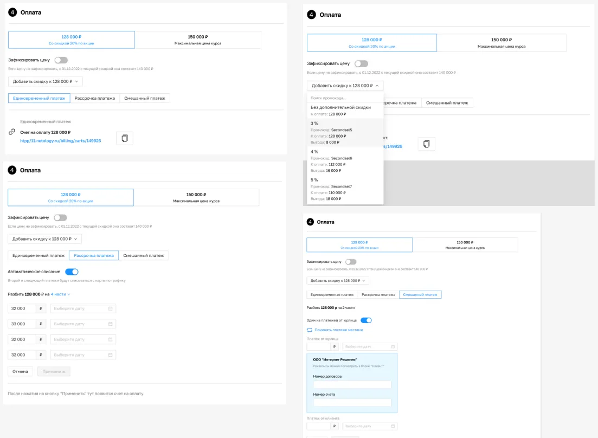
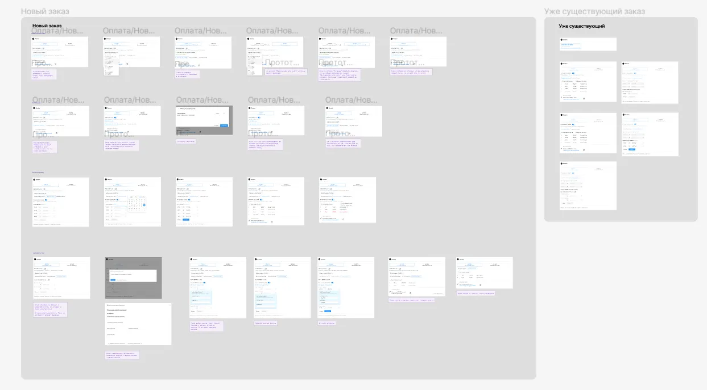

## Проблема

В команду пришел запрос от руководителя департамента продаж. Проблема заключалась в том, что менеджеры по продажам тратят порядка 10 минут на оформления заказа. Причина — проблема в UX и тупиковые флоу на странице оформления заказа.

Целью было оптимизировать процесс работы с заказом, чтобы увеличить среднее количество оформлений в день на 1 менеджера. Этот показатель составлял в среднем 20 заказов.

## Решение

### Этап 1. Исследование

Страница заказа состоит из нескольких блоков. Менеджеры по продажам во время общения с клиентом проходят определенный путь, двигаясь по странице сверху вниз. Для начала я решил выяснить на каком этапе у менеджеров возникают трудности. Для этого я решил провести интервью с пользователями (менеджерами), чтобы выявить проблемные места в флоу. В интервью приняли участие 7 респондентов.

**4 из 7 респондентов оценили удобство блока оплата на 8 баллов из 9. Еще 3 человека на 8 баллов. Результат показался странным, учитывая описание проблемы.**

В результате исследования я выяснил, что проблема заключается в блоке “Оплата”. Оказалось, что около 70% всех покупок осуществляется по внутренней рассрочке. Ежемесячно с карты плательщика списывается определенная сумма (рекуррентный платеж). При этом оказалось, что менеджер рассчитывает ежемесячного платежа на калькуляторе. Для поля каждого из платежей он вручную прописывает дату платежа с интервалом в месяц.

Всего менеджеры выделили 3 типа оплат: Единовременный платеж, рассрочка, смешанный платеж (часть оплачивается сразу, часть в рассрочку). При этом для каждого из этих трех флоу нужно было соблюсти определенный порядок действий, держа информацию в уме.

Также оказалось, что есть фиксированная и динамическая цена. В 90% случаев менеджер применяет скидочный промокод. Для этого он идет в гугл-таблицы, ищет там актуальный промокод, копирует его и вставляет на страницу заказа. Чем дальше от текуще даты набор на курс, тем меньше его цена. При этом есть два вида цены: фиксированная и динамическая. Менеджеры сообщили, что при динамической цене стоимость с промокодом будет изменяться ближе к дате старта курса.

Также оказалось, что около 40% от оформивших рекуррентный платеж хотят досрочно погасить задолженность. При таком сценарии если клиент хочет сделать частично-досрочное погашение и сократить срок выплат, менеджер переходит в редактирование платежей и увеличивает один из платежей, при этом сокращает число платежей.

С одной стороны мне удалось выявить ряд неудобств и проблем при оформлении заказа, но с другой — пользователи высоко оценили удобство работы с заказом. У меня возникла гипотеза, что, опрошенные мной респонденты привыкли к несовершенству админки, поэтому высоко оценили степень удобства при работе с ней. Чтобы проверить ее, я провел интервью с кагортой менеджеров, которые устроились на работы недавно (до полугода). Мне удалось найти 3 таких сотрудника. Они оценили степень удобства работы с админкой на 4 балла. Выделив непонятный нейминг и много ручной работы, которые расходуют когнетивный ресурс.

Старый интерфейс

### Этап 2. Приоритезация потребностей

Я начал этот этап с приоритезацией задач, которые выполняют менеджеры по продажам. К приоритету 1 я отнес основные сценарии, которые занимают много времени в текущей реализации. К приоритету 2 — второстепенные сценарии или задачи, которые занимают немного времени.

Стикеры в Миро

### Этап 3. LO-FI макеты

На основе потребностей пользователя накидал в Фигме основу для обсуждения с продактом. Затем сходил к бэку, чтобы уточнить, все ли реализуемо. После чего протестил на менеджерах решение. Было несколько комментариев. Отметив, что нужно поправить я перешел к HI-FI макетам.

Lo-Fi макеты

### Этап 4. HI-FI макеты

На HI-FI макетах я улучшил UX некоторых функций.

Я был в тесном контакте с лидом менеджеров по продажам. Мы проработали все возможные кейсы с блоком оплата.

### Этап 5. Передача в разработку

После передачи макетов фронту, приняли декомпозировать задачу и сначала сверстать верхний блок, а в следующем спринте нижний.

## Результат

После релиза команда получила много положительных отзывов от менеджеров по продажам. Время, потраченное на 1 заказ сократилось в среднем с 10 до 5 минут. Таким образом мне с помощью интерфейса удалось сократить на 50% время, потраченное менеджером на один заказ.
