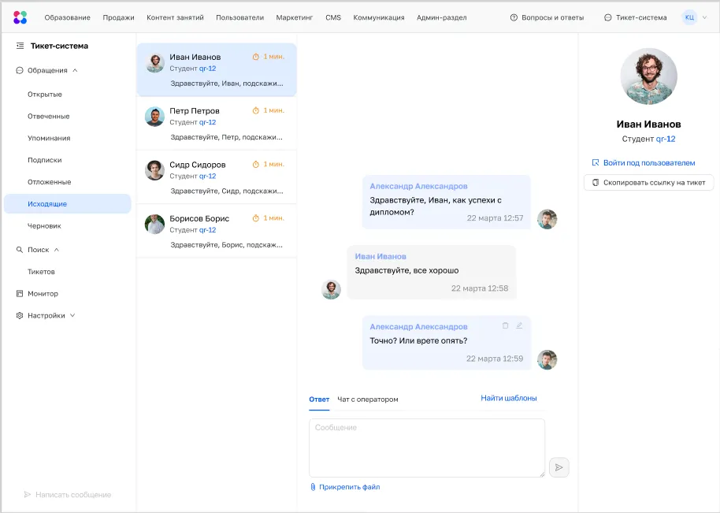

## Проблема

В образовательной среде нет единого пространства для коммуникации со студентами. Из-за этого контекст переписки часто теряется и вопросы студентов решаются долго.

## Решение

Было решено добавить исходящие сообщения в тикет-систему. В задаче было 19 требований.

У нас уже был готовый интерфейс тикет-системы и нужно было органично интегрировать новую фичу в него. Важно было учесть кейсы с групповой рассылкой и тэгами других сотрудников Нетологии, а также использовать минимум кастомных элементов.

Один из экранов

### Этап 2. Тестирование

В процессе проектирования я тестировал свои решения на координаторах (конечных пользователях) так как был постоянно в контакте с ними.

### Этап 3. Спецификация

В спецификации я декомпозировал задачу на создание исходящих сообщения и отправку сообщений группе. Групповые сообщения решено было реализовывать через несколько спринтов.

## Результат

В результате удалось перевести всю коммуникацию со студентами в один внутренний канал. Также был получен положительный фидбэк от координаторов
